# Building an End-to-End Solar Forecasting Platform: From Messy PV Data to Explainable, Uncertainty-Aware Model Serving

## How UNISOLAR combines leakage-safe time-series validation, multi-site modeling, recursive forecasting, and an operational dashboard

Solar forecasting projects are often presented as a model-selection exercise: load a dataset, train a few algorithms, report an R² score, and draw a prediction curve.

That is only the visible part of the problem.

A forecasting system that can be trusted in practice must answer harder questions. It must distinguish a missing power value from a measured zero and understand that weather is measured at campus grain while generation is measured at site grain. It must prove that a feature at time *t* does not contain information from the future, determine whether a model learned solar behavior or merely memorized plant identity, and define what happens when recent observations are absent. It must also explain how a model trained for one 15-minute step becomes a 24-hour API forecast, show an engineer why a prediction was made, and communicate when the available evidence is weak.

This article describes UNISOLAR, a complete solar photovoltaic forecasting platform built to address those questions from data ingestion through browser-based model serving. The project combines statistical baselines, XGBoost, recurrent neural networks, a Transformer, SHAP explanations, conformal prediction intervals, a FastAPI backend, and a React dashboard.

The emphasis is not only on the final score. It is on the decisions, safeguards, measurements, and failure modes that make the result interpretable.

The project is best understood as five connected systems rather than one application. The first system is a data contract: it defines what a timestamp, site, campus, observed value, missing value, and daylight state mean. The second is an experimental system: it controls how data is split, how statistics are fitted, and how models are compared. The third is a model system: it contains several forecasting families with different assumptions about missing data and site identity. The fourth is a serving system: it turns single-step estimators into recursive 24-hour forecasts. The fifth is a communication system: it exposes metrics, explanations, intervals, quality information, and limitations through a web interface.

The important design property is that these systems share the same semantics. The API does not invent a separate definition of a lag. The dashboard does not silently reinterpret the daylight flag. The deep-model serving path does not use a different window contract from the training path. That consistency is what allows an offline metric to remain connected to online behavior.

> **Repository:** The implementation, artifacts, tests, and decision log are contained in the project repository. Paths in this article refer to that repository.

---

## 1. The System at a Glance

UNISOLAR is a multi-site PV forecasting platform built on the UNISOLAR dataset. Its production path is organized as follows:

```text
Raw CSV data
    ↓
Schema inspection and mapping
    ↓
Validation and cleaning
    ↓
Timezone and solar-position derivation
    ↓
Partitioned processed Parquet
    ↓
Temporal, lag, rolling, weather, and solar features
    ↓
Leakage-safe chronological evaluation
    ↓
Baselines, XGBoost, LSTM, GRU, Transformer
    ↓
SHAP explanations and conformal intervals
    ↓
FastAPI recursive forecasting service
    ↓
React dashboard and training workflow
```

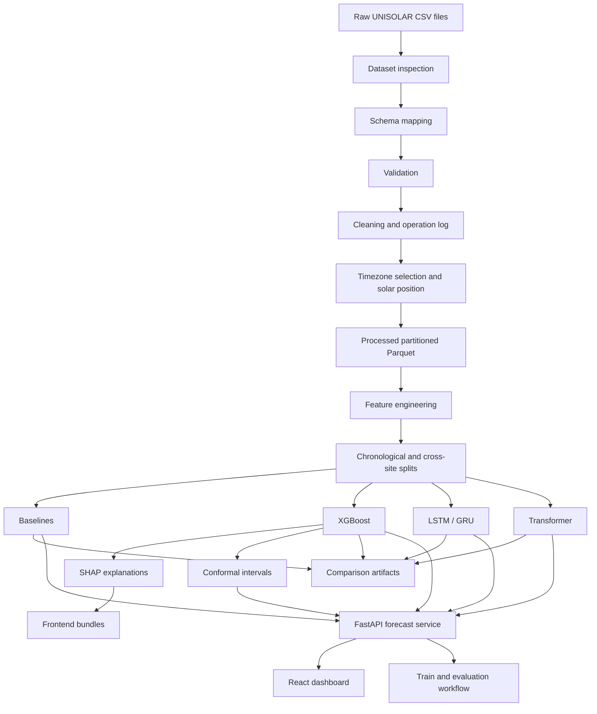

*Diagram A. UNISOLAR is an evidence-preserving pipeline: each stage produces artifacts that are consumed by the next stage, while the API and frontend reuse the same feature and model contracts established during training.*

The platform supports seven browser routes in the implemented frontend:

Dashboard, Forecast, Sites, Model Comparison, Explainability, Data Quality, and Train. The first six correspond to the core analytical product. The Train page was added afterward as a display-only job workflow that keeps the frozen serving artifacts separate from user-triggered experiments.

The most important measured single-step result is:

| Model | Test MAE | Test RMSE | Test R² | Training time |
|---|---:|---:|---:|---:|
| XGBoost | **1.056** | **2.530** | **0.951** | **10.6 s CPU** |
| Transformer | 1.124 | 2.544 | 0.950 | 437.2 s GPU |
| LSTM | 1.140 | 2.603 | 0.948 | 102.9 s GPU |
| GRU | 1.147 | 2.551 | 0.950 | 106.6 s GPU |
| Previous-day persistence | 2.783 | 6.294 | 0.699 | 0.1 s |

Those numbers are useful, but they become meaningful only after understanding the evaluation protocol and data problems behind them.

---

## 2. The Dataset Was Not Ready for Modeling

The dataset contains four CSV files:

1. `Solar_Energy_Generation.csv`
2. `Weather_Data_reordered_all.csv`
3. `Solar_Site_Details.csv`
4. `Monthly_Summary_Solar.csv`

The first implementation step was not model training. It was an inspection program, `scripts/inspect_dataset.py`, which profiled file formats, shapes, columns, data types, timestamp behavior, missingness, duplicates, possible target columns, site identifiers, and sampling frequency.

The inspection established these facts:

| Source | Rows | Grain | Important facts |
|---|---:|---|---|
| Generation | 2,731,946 | Site and timestamp | 42 sites, 5 campuses, 15-minute cadence, `SolarGeneration` target |
| Weather | 371,769 | Campus and timestamp | Six weather variables, not site-specific |
| Site details | 42 | Site metadata | Capacity and installation fields; coordinates are campus-level |
| Monthly summary | 1,176 | Site-month | Auxiliary aggregate, not used for model fitting |

The canonical internal row is intentionally richer than the raw generation row. A generation record identifies a site and campus, carries a local timestamp, and contains power. The weather join adds campus-level environmental context. The cleaning stage adds reporting and physical-state information, while the feature stage adds representations that are safe to compute before the target is known.

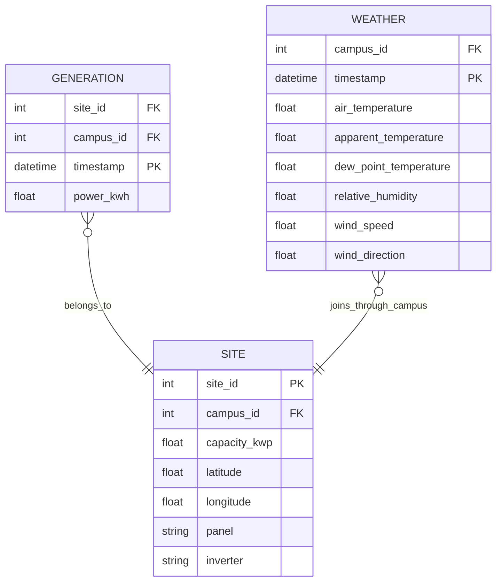

*Diagram B. Generation is site-grained, weather is campus-grained, and static site metadata supplies the spatial relationship needed to join and derive solar geometry.*

The generation target is missing in 56.2% of rows. This is not a small nuisance to be handled with a default `fillna(0)`.

The missingness is also not a simple random sample. The EDA found no fully reporting site and no site that was more than 90% empty, which suggests a combination of structural reporting patterns, gaps, and operational outages rather than one completely disconnected plant. Weather gaps are concentrated in a long period from August 2021 through April 2022, where more than 80% of weather values are missing in individual months. A model trained without understanding this structure would be evaluated on a mixture of genuinely observed production and rows whose context is unavailable.

That distinction changes the meaning of every downstream statistic. A mean computed after converting missing power to zero is no longer a mean of observed production. A lag filled with zero no longer means “the plant produced nothing at the prior timestamp”; it means “the pipeline could not find a prior report and chose to represent that uncertainty as a physical zero.” The project avoids that semantic collapse.

In solar data, zero and missing are fundamentally different. A zero can represent a legitimate night-time observation, while a missing value can mean that the plant did not report. Filling missing generation with zero can make an outage look like night-time production and can contaminate lags, rolling features, baselines, and model targets.

The project therefore adopted a strict rule: **power is never imputed**. Missing power remains missing, and training or evaluation rows are selected according to whether an observed target and a valid prediction are available.

Weather required a different strategy. Temperature, apparent temperature, dew point, humidity, and wind speed were interpolated only across gaps of at most two 15-minute steps. Wind direction was not linearly interpolated because angles are circular; 359° and 1° are close physically but far apart numerically.

The resulting data policy can be summarized as a decision tree:

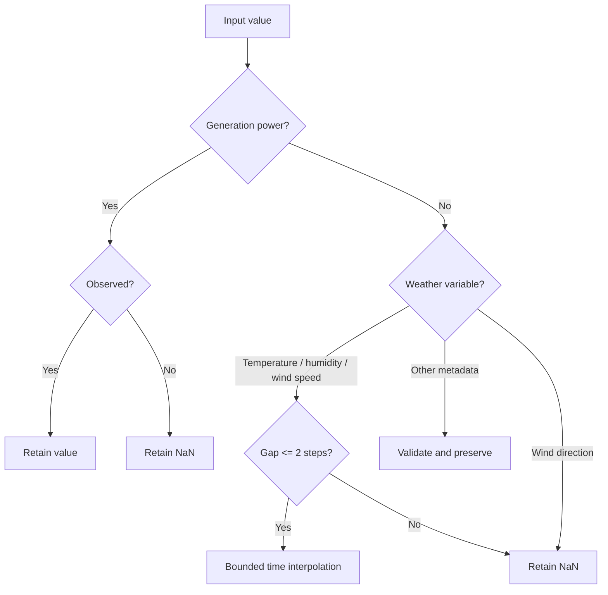

*Diagram C. The missing-value policy distinguishes a missing measurement from a measured zero and limits interpolation to short, defensible weather gaps.*

The pipeline recorded each cleaning action in a `CleanLog`, rather than silently deleting or mutating rows. Exact duplicate rows could be removed; impossible numeric values were nulled while the original rows were retained for auditability.

The resulting processed data contains 2,731,946 rows and 14 columns, stored as partitioned Parquet under `data/processed/solar/`.


*Figure 1. The daylight power distribution is strongly right-skewed. The EDA measured a median of 3.34 kWh, a mean of 6.95 kWh, a 99th percentile of 65.88 kWh, and a maximum of 99.22 kWh.*

---

## 3. Timezone Selection Was a Modeling Decision

The raw timestamps are naive local wall-clock timestamps. Solar geometry cannot be calculated correctly until those timestamps are associated with a timezone.

Two candidate interpretations were compared:

- Fixed UTC+10 time.
- Civil `Australia/Melbourne` time with daylight saving transitions.

The project selected `Australia/Melbourne` empirically. On a sample of generation rows:

- Night-time nonzero generation was 0.12% under Melbourne civil time.
- Night-time nonzero generation was 3.43% under fixed UTC+10.
- The day/night mean contrast was also stronger under Melbourne time.

This matters because the project derives `is_daylight` from apparent solar elevation computed with `pvlib`. The selected timezone affects:

day/night classification, solar elevation and zenith, day length, seasonal and hourly feature interpretation, and the frontend’s night shading. A 15-minute forecasting dataset can appear numerically correct while being physically misaligned by an hour around daylight-saving transitions. That kind of error is especially dangerous because it does not necessarily produce a parsing exception; it produces plausible-looking but shifted solar curves.

Daylight is defined as apparent solar elevation greater than 0°. Ambiguous daylight-saving rows are retained, but their elevation is left unavailable rather than fabricated. The processing run recorded 456 such rows.


*Figure 2. Campus profiles align in time but differ substantially in scale, reflecting the heterogeneous plant capacities represented in the data.*

This was one of the first indications that pooled analysis alone would be misleading.

The site-aware analysis therefore became a formal project decision rather than an EDA footnote. For statistic-based baselines, the platform computes both a global and a site-specific variant. For model evaluation, it reports aggregate rows and per-site rows. For cross-site testing, it explicitly separates sites seen during fitting from sites held out entirely. The goal is not to make the numbers look worse; it is to make it possible to tell which population the numbers describe.

---

## 4. Why Site-Aware Analysis Is Necessary

The dataset contains large plant-size differences. The highest-output sites have mean daylight production many times larger than the smallest sites. Campus 1 alone contains 27 of the 42 sites.

If all rows are pooled, a correlation can mix two distinct effects:

1. Whether the sun or weather affects production.
2. Whether the observation came from a large or small plant.

The EDA showed this clearly:

| Relationship with power | Pooled correlation | Mean within-site correlation |
|---|---:|---:|
| Solar elevation | 0.34 | 0.74 |
| Humidity | -0.23 | -0.50 |
| Temperature | 0.19 | 0.42 |

The within-site relationship is much stronger. Therefore, the platform reports metrics both across all observations and per site. Baselines include both global and per-site means. Site identity is treated as a first-class modeling issue, not an incidental column.


*Figure 3. Site-level output varies widely. Absolute error must be interpreted in the context of plant scale, which is why per-site metrics accompany pooled metrics.*

This decision also motivated a dedicated cross-site experiment: can a model forecast a plant it never saw during training?

---

## 5. Feature Engineering Without Looking Ahead

The feature table has 51 columns: 14 base columns and 37 engineered columns.

The feature builder is deliberately ordered. Timestamp-only features are created first. Calendar-exact lags are then joined from the historical power table. Rolling features are calculated with the current row excluded. Weather transformations follow, and solar-position features are recomputed from the chosen timezone and campus coordinates. This order is important because the feature table is not just a collection of columns; it is a causal representation of what would have been knowable immediately before the forecast target.

### Temporal features

The temporal layer includes hour and minute, day of week and day of year, ISO week, month, quarter, weekend indicators, southern-hemisphere meteorological season, and cyclical encodings for hour and day of year. The southern-hemisphere convention is not cosmetic: December, January, and February are treated as summer, while June, July, and August are winter.

Cyclical encoding avoids treating 23:45 and 00:00 as numerically far apart:

\[
hour_{sin} = \sin\left(2\pi\frac{hour}{24}\right),
\qquad
hour_{cos} = \cos\left(2\pi\frac{hour}{24}\right)
\]

The same principle is used for day-of-year.

### Calendar-exact lags

The model uses power lags at 1, 2, 4, 8, 24, 48, and 96 15-minute steps. A naive implementation might use `shift(n)`. That is unsafe when the time series has missing grid slots.

Instead, each lag is a timestamp lookup:

\[
lag_{\Delta}(t) = power(t - \Delta)
\]

If the exact prior timestamp is absent, the lag remains `NaN`. It is not silently replaced by the nearest row.

The implementation verified the written feature table against more than one million lag pairs with zero mismatches for the tested lags.

### Closed-left rolling features

Rolling statistics use 1-hour, 6-hour, and 24-hour windows with mean, standard deviation, minimum, and maximum.

The window is explicitly:

\[
[t-W, t)
\]

The current observation at *t* is excluded. Including it would leak the target into the feature used to predict that same target.

Missing values are excluded from the rolling calculation rather than treated as zero. Standard deviation remains unavailable until at least two valid values are present.

### Weather and solar features

Weather features pass through the available variables dynamically. Wind direction becomes:

\[
wind\_dir_{sin} = \sin(\theta),
\qquad
wind\_dir_{cos} = \cos(\theta)
\]

Solar features include apparent elevation, azimuth, zenith, a daylight flag, and day length. No irradiance feature was invented because no irradiance measurement exists in the source files.


*Figure 4. Weather variables are themselves strongly correlated, while their relationship with power depends heavily on site scale and solar position.*

---

## 6. Establishing a Baseline Before Using Deep Learning

A model should not be called useful until it beats simple alternatives.

UNISOLAR begins with four progressively stronger reference points: a zero predictor, a global mean, a per-site mean, and same-time-previous-day persistence. The first two establish how much accuracy comes from the target distribution alone. The site mean asks whether plant identity and long-run scale are enough to explain the target. Persistence is the most meaningful operational baseline because photovoltaic output has a strong daily rhythm.

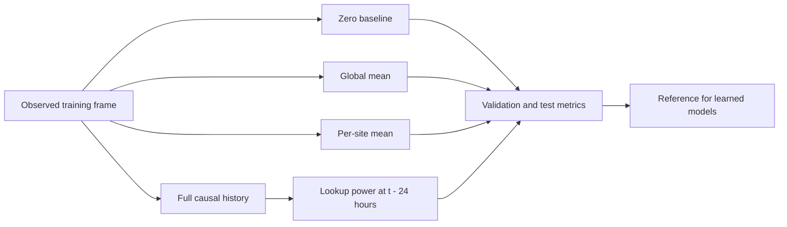

*Diagram D. Baselines establish the minimum standard that every learned model must exceed under the same split and metric definitions.*

Persistence is the primary baseline:

\[
\hat{y}_t = y_{t-24h}
\]

It is fit against the full historical table for lookup availability, but the lookup is strictly causal: the prediction at *t* reads only a timestamp earlier than *t*. Unit tests verify that corrupting later rows cannot alter earlier predictions.

On the test split, persistence achieved:

an MAE of 2.783 kWh, an RMSE of 6.294 kWh, and an R² of 0.699. That is a substantial baseline, not a straw man. A model can obtain an attractive score by learning the solar day shape; it becomes more convincing when it improves on the value from the previous day without looking into the future.

This baseline is already meaningful because solar generation has a strong daily cycle. A machine-learning model must improve on it without violating temporal ordering.

---

## 7. XGBoost: The Strongest Model for the Main Task

The XGBoost model predicts one 15-minute step using:

recent power history, rolling statistics, calendar features, solar geometry, weather variables, and native categorical site identity. The feature layout is selected dynamically from the available engineered columns, which lets the pipeline remain explicit about absent source variables rather than creating placeholder irradiance or cloud features.

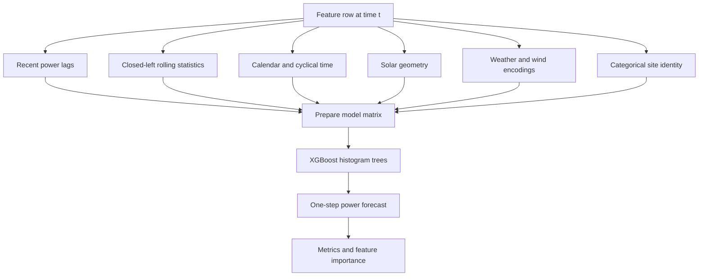

*Diagram E. The XGBoost path combines causal engineered history with current-time covariates and produces a single 15-minute prediction.*

The target is not imputed. Rows with missing target values are excluded from supervised fitting, while feature missingness remains available to XGBoost’s native missing-value handling.

The model uses the CPU histogram tree method and configuration-driven hyperparameters. Early stopping selected iteration 109 from a maximum of 2,000 trees.

The test result was:

| Metric | Result |
|---|---:|
| MAE | **1.056 kWh** |
| RMSE | **2.530 kWh** |
| R² | **0.951** |
| nRMSE | 0.026 |
| Daylight MAE | 1.052 kWh |

Relative to persistence, XGBoost reduced test MAE by approximately 62% and RMSE by approximately 60%.

The gain-based feature importance was dominated by recent history:

| Feature | Gain share |
|---|---:|
| One-hour rolling mean | 44.5% |
| One-step lag | 41.6% |
| One-hour rolling minimum | 2.1% |
| One-hour rolling maximum | 1.6% |

This is a useful result in itself. At a 15-minute horizon, recent plant behavior is more predictive than a complex architecture that has to rediscover that short-term continuity.

There is also a subtle distinction between gain importance and SHAP importance. Gain reports how much a feature contributes to tree split improvement during training. SHAP later measures the magnitude of each feature’s contribution to individual predictions. Both analyses agree that recent history dominates, but they answer slightly different questions. Gain describes the model’s internal split utility; SHAP describes the model’s output attribution on selected evaluation rows.

---

## 8. LSTM, GRU, and Transformer Models

The sequence models use the same single-step task and the same chronological split so that architecture comparisons remain meaningful.

Each sequence window contains 96 historical steps, equivalent to 24 hours, plus the current step needed for the covariate context. The channel matrix contains power, a power-observed mask, temporal features, weather features, circular wind features, and solar features.

The sequence formulation is not simply “feed the last 96 rows to a neural network.” It has two separate representations of generation. The power channel carries the available historical values, with missing entries zero-filled for numerical compatibility. The observation mask carries whether each value was actually observed. Without that second channel, the network could confuse a genuine zero-output night interval with a missing report.

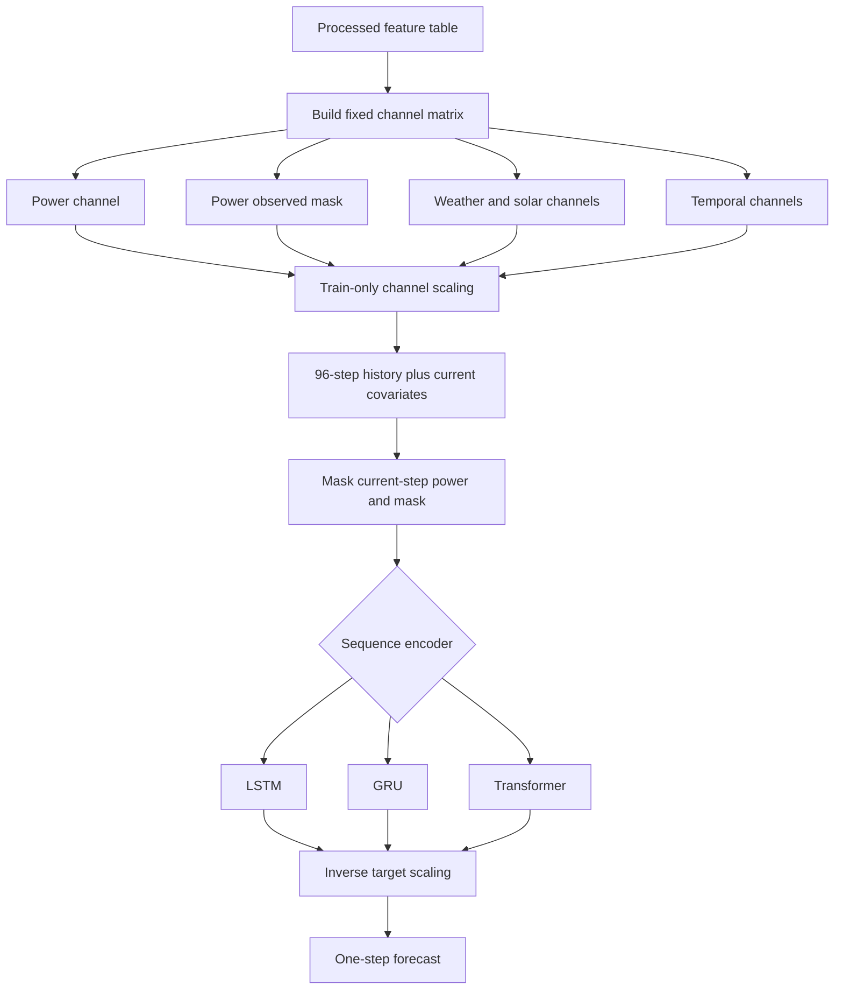

*Diagram F. The sequence path separates value availability from value magnitude and applies the same current-step leak guard to all three deep architectures.*

Because neural networks cannot directly consume the project’s missing values, missing channels are zero-filled and accompanied by explicit observation information. The current-step power and mask channels are then zeroed before the forward pass.

That last step is essential. During development, an early run accidentally exposed the current target through the input window and produced an implausible R² of 1.000. The run was discarded, the artifacts were removed, and the leak guard was added to both the implementation and tests.

The Transformer reuses the same windows, scaler, training loop, and target masking. Its only major experimental change is the sequence encoder:

a pre-layer-normalized encoder with fixed sinusoidal positional encoding, GELU feed-forward layers, and a last-position readout. It does not use a causal attention mask because the window is constructed entirely from historical positions and the only dangerous value, current-step power, is explicitly masked.

The model comparison shows an important engineering lesson: more expressive sequence architectures did not provide a decisive advantage on this short-horizon task. The three deep models cluster near R² = 0.95, while XGBoost reaches the best MAE with a fraction of the training time.


*Figure 5. The comparison view combines current API metrics with bundled evaluation artifacts, including all-run comparisons and cross-site results.*

---

## 9. Cross-Site Generalization: A Different Question

Random row splits would not answer whether the model can handle a new plant. Even a chronological split can overstate performance if every site appears in training.

The cross-site protocol holds out sites entirely:

30 sites for training, 6 for validation, and 6 for testing. The site assignment is seeded, and the held-out sites contribute no rows to training or scaler fitting.

Held-out test sites contribute their full observed history only to evaluation. They do not influence training, scaling, or early stopping.

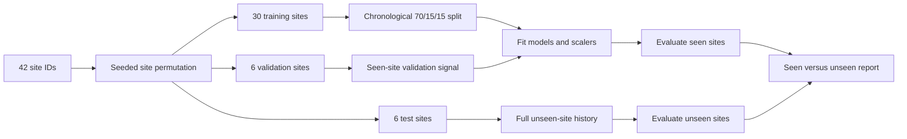

*Diagram G. The cross-site protocol separates spatial generalization from ordinary temporal forecasting. A held-out site never contributes to training or normalization.*

The test results are:

| Model | Seen-site MAE | Unseen-site MAE | Seen R² | Unseen R² |
|---|---:|---:|---:|---:|
| Transformer | 1.332 | **0.764** | 0.947 | **0.897** |
| GRU | 1.363 | 0.771 | 0.947 | 0.890 |
| LSTM | 1.384 | 0.801 | 0.946 | 0.885 |
| XGBoost | **1.241** | 1.242 | **0.949** | 0.795 |
| Persistence | 3.308 | 1.821 | 0.687 | 0.427 |

The lower absolute error for unseen sites should not be interpreted as automatic proof that deep models are intrinsically superior. The held-out sites were smaller plants than the training population, and absolute error scales with plant output.

The more important result is the change in ranking and behavior:

XGBoost is strongest on known sites, while the Transformer is strongest on the held-out-site protocol. XGBoost’s unseen-site R² falls to 0.795, and one held-out XGBoost site reaches R² = -6.859.

The likely mechanism is site identity. XGBoost uses `site_id` as a native categorical feature. An unseen category cannot provide the plant-specific calibration learned for known sites. The sequence models do not use that categorical site identity in their channel matrix, making them less dependent on memorized plant labels.

This distinction is central to production model selection. The best model for known assets is not automatically the best model for future asset expansion.

---

## 10. Explainability With SHAP

A good score does not explain a forecast. UNISOLAR uses exact TreeSHAP for XGBoost because tree-based explanations are fast, deterministic, and naturally aligned with named tabular features.

The SHAP analysis uses a seeded 20,000-row sample of observed test rows. It also selects representative local scenarios:

clear noon peak, morning ramp, overcast afternoon, and night-time zero generation. This combination matters because global importance and local diagnosis serve different purposes. The global sample summarizes what the model usually uses. The scenario selection deliberately searches for operating conditions that are rare, transitional, or operationally interesting.

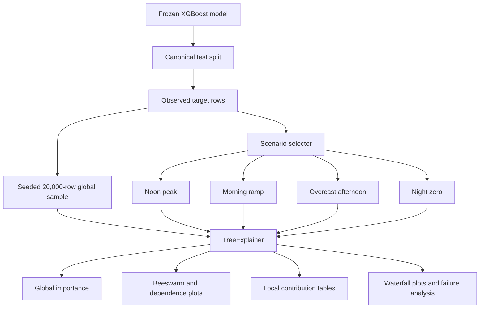

*Diagram H. The explainability workflow uses a frozen evaluation model and separates global behavior from targeted local scenarios.*

The top global attributions are:

| Rank | Feature | Mean absolute SHAP share |
|---:|---|---:|
| 1 | One-step power lag | 34.9% |
| 2 | One-hour rolling mean | 23.1% |
| 3 | One-hour rolling minimum | 4.0% |
| 4 | Sine hour | 3.8% |
| 5 | Solar elevation | 2.9% |
| 6 | Site identity | 2.4% |

The additive explanation was validated with a maximum absolute error of `6.9e-05` between the model prediction and the SHAP base value plus feature contributions.


*Figure 6. SHAP global importance confirms that recent generation history dominates the XGBoost forecast.*

The local explanations are more revealing than the global ranking.


*Figure 7. A night-time failure case shows how missing recent lags can route XGBoost through default branches learned primarily from daytime examples.*

The measured night-time failure mode is stark:

| Condition | Night rows | MAE |
|---|---:|---:|
| Recent lag present | 248 | **0.157** |
| Recent lag missing | 231 | **5.421** |

In the selected night scenario, the model predicted 13.47 kWh when the observed value was 0.12 kWh. This does not invalidate the entire model. It identifies a specific operational condition under which its output should be distrusted.

That is the practical value of explainability: not merely ranking features, but exposing where the model’s assumptions fail.

---

## 11. Conformal Prediction for Honest Uncertainty

Point forecasts are incomplete for operational planning. A grid operator, battery controller, or site manager needs to know how much uncertainty surrounds the forecast.

UNISOLAR implements split conformal prediction using absolute residuals. For a calibration set of observed values and predictions:

\[
score_i = |y_i - \hat{y}_i|
\]

The conformal radius is an appropriate finite-sample quantile of those scores. The interval is:

\[
[\hat{y} - q, \hat{y} + q]
\]

Calibration is performed on validation rows, and coverage is measured on test rows. This was implemented for XGBoost and persistence.

The key idea is deliberately model-agnostic. Conformal prediction does not ask the model to output a variance estimate and does not require a new model for every confidence level. It observes how wrong the frozen predictor was on calibration data, converts those errors into a quantile, and attaches that empirical error radius to future predictions. The guarantee is marginal and depends on the usual exchangeability assumption; it is not a promise that every site and every regime will have identical coverage.

A single global interval would be inefficient because the model’s error is heteroscedastic. The platform therefore uses Mondrian regimes based on information available at inference time:

day versus night and recent lag present versus missing.

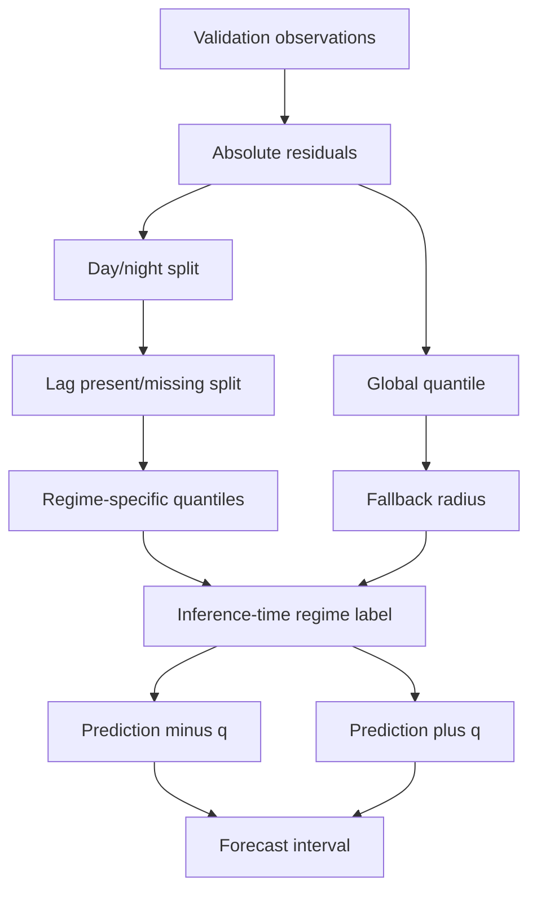

*Diagram I. Conformal calibration converts validation residuals into global and regime-specific radii. The API selects a radius using only information available at forecast time.*

For XGBoost at nominal 90% coverage:

| Regime | Coverage | Mean interval width |
|---|---:|---:|
| Day with lag | 0.916 | 5.829 kWh |
| Day without lag | 0.930 | 6.152 kWh |
| Night with lag | 0.948 | **0.875 kWh** |
| Night without lag | 0.944 | **26.822 kWh** |

The wide night-without-lag interval is not a cosmetic detail. It prices the exact failure mode found by SHAP.


*Figure 8. The quality view connects data gaps with model reliability. In this project, uncertainty is deliberately sensitive to missing recent history.*

There are important limitations:

A shared absolute radius undercovers some large plants; three major sites have coverage near 0.54–0.59. The interval lower bound is not clipped, because clipping would alter the empirical coverage guarantee. Deep models do not yet have their own conformal calibration artifacts.

The system therefore exposes uncertainty without pretending that one interval is equally valid for every plant and regime.

---

## 12. Turning a Single-Step Model Into a 24-Hour API Forecast

The trained models predict one 15-minute step. The API supports up to 96 steps, or 24 hours, using recursion:

```text
Predict t+1
    ↓
Append prediction to the site history
    ↓
Refresh lags and rolling statistics
    ↓
Predict t+2
    ↓
Repeat through t+96
```

The first implementation rebuilt the full feature frame at every step. That was correct but unnecessarily expensive. The optimized implementation separates features into two categories:

### Static features

Computed once for the full tail and future horizon:

- Calendar features.
- Solar geometry.
- Carried-forward weather.

### Prediction-dependent features

Updated incrementally:

- Exact timestamp lags.
- Closed-left rolling statistics.

The `_PowerHistory` structure reproduces the batch feature semantics using timestamp-keyed searches. Tests compare the incremental path with the batch reference on gappy time series and real data.

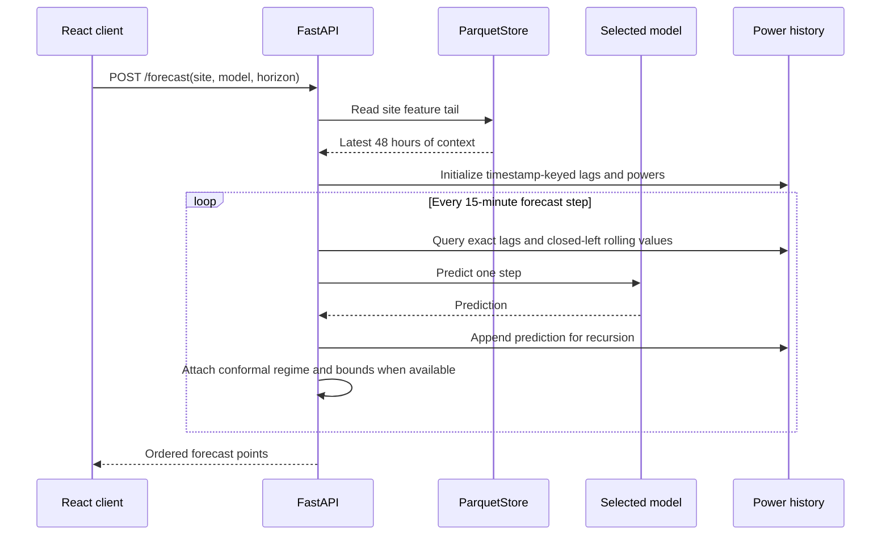

*Diagram J. A multi-step API forecast is a stateful recursive computation, not a single model call with a 96-row output.*

Measured 96-step latency improved substantially:

| Model | Before | After |
|---|---:|---:|
| XGBoost | 2.99 s | **0.57 s** |
| LSTM | 2.35 s | **0.22 s** |
| GRU | 2.64 s | **0.53 s** |
| Transformer | 2.38 s | **0.22 s** |
| Persistence | 0.10 s | 0.09 s |

The frontend adds a promise cache keyed by site, model, and horizon, plus a 300 ms slider debounce.

Future weather is carried forward from the last observation. There is no numerical weather prediction feed in version 1, so longer-horizon forecasts should be interpreted accordingly.

This creates an explicit boundary around what the current API claims. The system can extrapolate the learned response under the observed weather state, but it is not a full weather-coupled forecasting system. During a rapidly changing weather event, forecast error may accumulate because the future weather covariates remain constant while the real atmosphere changes.

---

## 13. The API and Data Store

The backend is a FastAPI application under `/api/v1`.

The primary endpoints are:

```text
GET  /health
GET  /dataset
GET  /sites
GET  /sites/{site_id}/history
GET  /models
GET  /models/{model_id}/metrics
POST /forecast
POST /forecast/batch
```

The `ParquetStore` reads only the requested site partitions for history and forecasting. This prevents routine endpoints from loading the full 2.7-million-row table.

The model registry currently includes:

persistence, XGBoost, LSTM, GRU, and Transformer.

All five are served in the current implementation. XGBoost receives Mondrian conformal bounds. Persistence receives no conformal bounds. Deep-model forecasts currently have no model-specific interval because deep conformal calibration was not implemented.

For serving, deep checkpoints are not sufficient by themselves. The model weights are accompanied by exported channel and target scalers under `artifacts/{model}/serving_scalers.json`. The export process validates that the reloaded checkpoint and scalers reproduce stored predictions.

---

## 14. The Dashboard as an Analytical Interface

The React frontend is not merely a chart wrapper around one endpoint. It combines live API data with static artifact-derived bundles.

The live/static split is intentional. Forecasts, history, sites, and model metrics are request-dependent and come from FastAPI. SHAP plots, EDA aggregates, quality summaries, and large evaluation-series data are derived from frozen artifacts and bundled into the frontend at build time. This avoids expanding the REST API with endpoints that would mostly duplicate generated reports, but it introduces a freshness responsibility: the export script must be rerun after upstream artifacts change.

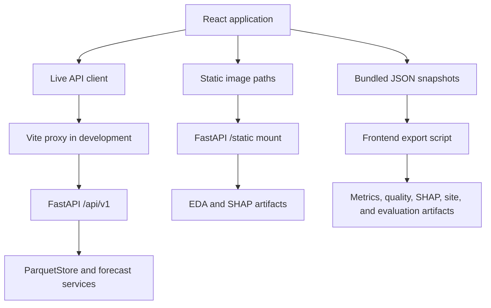

*Diagram K. The frontend combines live operational data with reproducible, artifact-derived analytical snapshots.*

### Dashboard

The Dashboard combines the latest observed power, last-day energy, the next 24-hour forecast, a comparison against the persistence baseline, an observed-to-forecast continuity strip, conformal bounds, night shading, monthly site energy, campus comparisons, hour-of-day profiles, and weather-power correlations. Its purpose is to put a forecast in context: a user can see not only what the next day is expected to produce, but also what the selected site has historically reported and how the current site compares with its campus.


*Figure 9. The Dashboard combines operational summary cards with forecast continuity and artifact-derived analytical views.*

### Forecast

The Forecast page provides model selection, a one-to-96-step horizon control, historical context, recursive future predictions, CSV download, and conformal bounds where available. The horizon control changes the length of the recursive request, while the selected history provides visual context rather than moving the forecast origin away from the latest dataset observation.


*Figure 10. The Train workflow begins with schema-aware dataset verification before a model job can start.*

### Sites

The Sites page is driven by a generated site-summary bundle containing campus, coordinates, data span, mean daylight energy, peak energy, row availability, and observed-power percentage. It is intentionally descriptive rather than predictive: its job is to make the population of assets visible before a user interprets model metrics.

### Model Comparison

This page combines live API metrics with static evaluation series and cross-site summaries. It includes model tables, all-run comparisons, prediction-versus-actual exploration, residual views, and seen-versus-unseen site analysis.


*Figure 11. The prediction explorer exposes model behavior beyond a single aggregate metric.*

### Explainability

The Explainability page serves bundled SHAP importance data and static plots generated from the frozen XGBoost run.

### Data Quality

The Quality page surfaces duplicate keys, impossible values, outlier counts, missing generation slots, weather missingness over time, per-site availability, and EDA distributions. This gives the dashboard a place to explain why a forecast may be uncertain instead of presenting uncertainty as an unexplained model property.

### Train

The Train page lets users verify a dataset, select a model, launch a job, monitor stage markers, and download job-scoped artifacts. These jobs are intentionally isolated from the production model directory.

The training workflow is designed around an important operational principle: experimentation must not overwrite the model currently serving the dashboard. A verified dataset receives an identifier, a selected model receives a job identifier, and every intermediate product is written below that job directory. The job emits markers for verification, preparation, baseline construction, training, evaluation, and completion. The API watcher reads those markers and reconstructs progress from the filesystem, which also makes the workflow tolerant of the known PyTorch teardown behavior that can produce exit code 9 after a successful run.

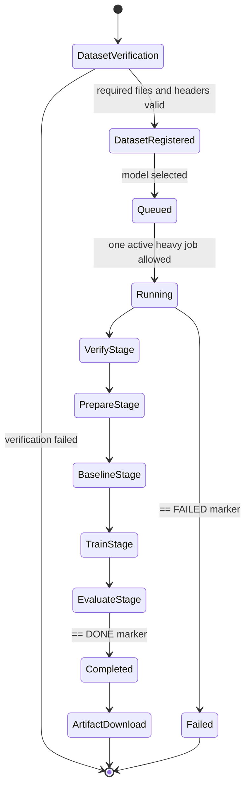

*Diagram L. The Train page is a filesystem-backed state machine. The completed marker is authoritative because a successful CUDA run can still return a nonzero teardown code.*

The project has verified the frontend build and lint pipeline. It does not currently include a frontend unit-test or browser-test suite in CI, so the UI’s strongest automated assurance comes from TypeScript compilation, linting, build success, backend API tests, and manually recorded visual verification.

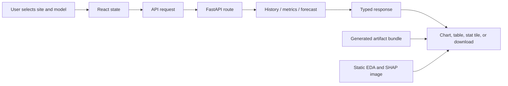

*Diagram M. A dashboard view is assembled from live request state, API responses, and generated analytical assets.*

---

## 15. Testing and Leakage Prevention

The current Python suite collects 174 tests across:

The coverage spans data validation, timestamp and daylight-saving handling, missing-value policy, baselines, chronological and cross-site splits, temporal feature correctness, future leakage in lags and rolling windows, weather interpolation limits, train-only scaling, sequence window construction, current-step target masking, XGBoost feature selection and determinism, SHAP additivity, conformal calibration and coverage, recursive API forecasts, incremental feature equivalence, training API job markers, and export bundle generation.

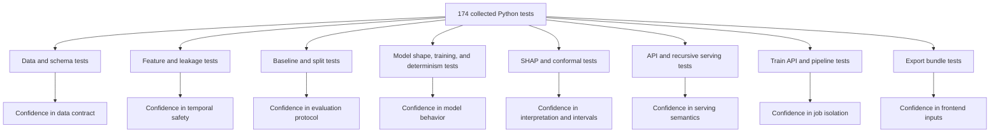

*Diagram N. The test suite is organized around invariants and interfaces, not only around individual functions.*

The leakage tests are especially important because time-series leakage often produces plausible-looking but invalid results.

Examples of enforced properties include:

A future power perturbation cannot change an earlier lag or rolling statistic. Weather interpolation cannot reach across long gaps, power is never interpolated, evaluation corruption cannot change train-fitted scalers, held-out sites cannot appear in training frames, the current sequence target must be masked before inference, and incremental serving features must match the batch implementation.

The repository also records reproducibility metadata, dataset fingerprints, model configuration, seed values, and artifact paths for each major run.

### How to read the reported metrics

MAE is the average absolute forecast error and is easy to interpret in the dataset’s kWh units:

\[
MAE = \frac{1}{n}\sum_{i=1}^{n}|y_i - \hat{y}_i|
\]

RMSE gives larger errors more weight:

\[
RMSE = \sqrt{\frac{1}{n}\sum_{i=1}^{n}(y_i - \hat{y}_i)^2}
\]

That difference matters in this dataset because a model can be close during low-output periods and still make large mistakes around midday peaks. R² measures improvement relative to the mean target, but it can be unstable or negative for small sites with unusual variance. For that reason, the project does not use R² alone.

nRMSE is normalized using the observed power range in the training slice. The pooled denominator is approximately 99.12 kWh under the main protocol. The denominator is not capacity-based because capacity is unavailable for 17 of the 42 sites. This keeps the metric defined for every site, but it also means that absolute MAE and per-site coverage must be read alongside nRMSE rather than replaced by it.

Daylight-only metrics are reported separately because a large number of night observations can make an apparently strong model look better than it is during active generation. Rows with missing truth or missing predictions are counted explicitly through evaluation metadata rather than silently filled or dropped.

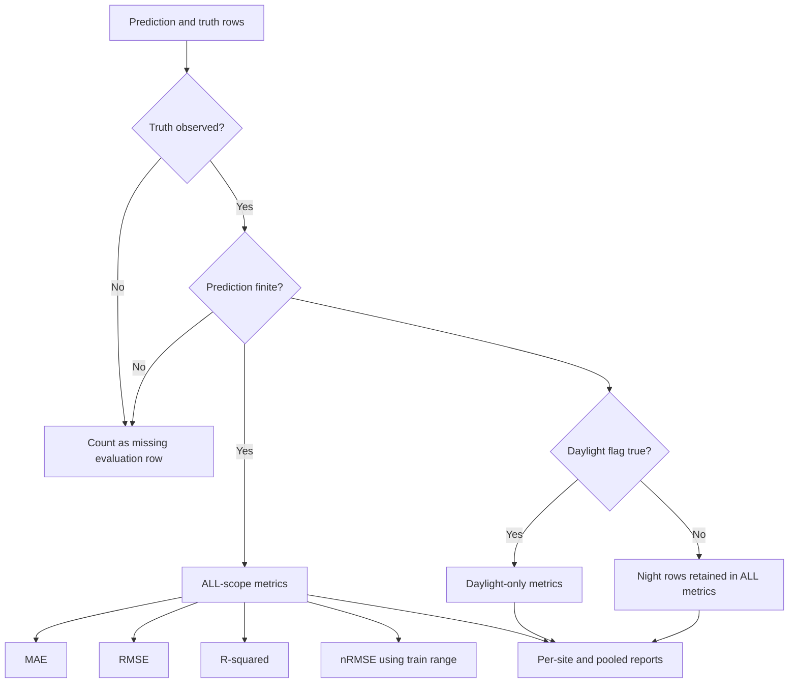

*Diagram O. Evaluation is explicit about observed truth, finite predictions, daylight subsets, missing counts, and normalization denominators.*

---

## 16. Deployment: What Exists and What Does Not

Docker Compose defines seven services:

backend, frontend, PostgreSQL, MLflow, Redis, Prometheus, and Grafana.

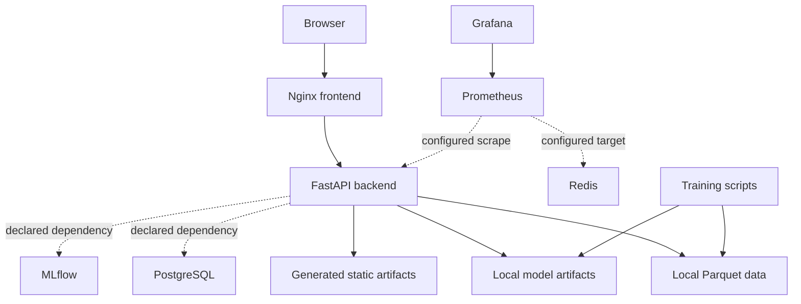

*Diagram P. The Compose file includes a broader infrastructure topology than the current FastAPI implementation actually requires. The solid paths are the demonstrated application data path; dotted paths represent declared or configured operational connections.*

The backend and frontend Dockerfiles exist, and the application can be run locally with the documented Python and Node tooling. However, the repository should not be described as having a fully automated production deployment without qualification.

Several operational limitations remain:

Large datasets and trained models are ignored by Git, so a clean clone does not automatically contain all serving artifacts. The Compose frontend bind mount can hide the image’s built frontend if the host `frontend/dist` directory is missing or stale. Prometheus is configured to scrape an API metrics endpoint that is not implemented, Redis is targeted directly without a Prometheus exporter, Grafana provisioning paths referenced by Compose are absent, port 443 is published without TLS configuration, deployment workflow jobs are placeholders that report deployment steps rather than executing them, and the native health-check utility uses Unix-oriented shell behavior that is not reliable as a Windows-native diagnostic.

This distinction matters. The forecasting application is substantially implemented; the infrastructure layer is a prototype deployment composition that requires hardening before being called production-ready.

The intended operational boundary is therefore clear:

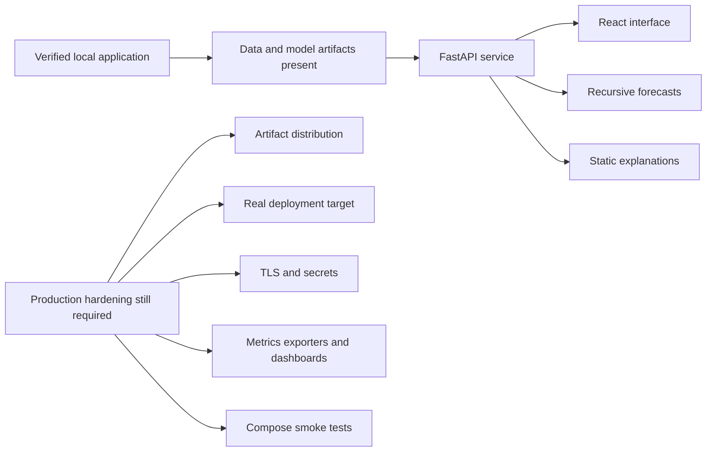

*Diagram Q. The repository demonstrates a working forecasting application and a deployment composition, but the final production boundary still needs artifact packaging, executable deployment, TLS, monitoring integration, and infrastructure tests.*

---

## 17. What the Project Demonstrates

UNISOLAR’s most important contribution is not that one model achieved an R² of 0.951. It is that the project connects model quality to system behavior.

The platform demonstrates several general principles.

### Data quality is part of the model

The 56.2% target missingness affected every downstream decision: masking, evaluation, lags, rolling features, SHAP failure analysis, and uncertainty regimes.

### A baseline prevents self-deception

Persistence established that the task already contains strong daily structure. The final model’s improvement over that baseline is more informative than comparison against a zero predictor alone.

### Short horizons reward recent history

The single-step task is dominated by the latest observed power and rolling context. XGBoost captured this efficiently.

### Generalization changes the winner

XGBoost was strongest on known sites. The Transformer was strongest on unseen sites. Model selection depends on the deployment population.

### Explainability should find failure modes

The SHAP analysis exposed a night-time missing-lag problem that aggregate metrics would have hidden.

### Uncertainty should reflect data quality

The conformal interval became dramatically wider when recent history was missing. That is the correct direction: uncertainty should increase when the model has less reliable evidence.

### Serving is a separate engineering problem

Training a single-step model and exposing a 24-hour endpoint requires recursion, feature-state management, model caching, scaler management, latency optimization, and a clear contract for future covariates.

### Documentation must remain subordinate to evidence

The repository contains authoritative measured artifacts, but it also contains stale documentation about page counts, licensing, testing, and deployment. A professional system must distinguish verified behavior from aspirational configuration.

---

## 18. Final Perspective

Solar forecasting is a deceptively rich systems problem. The physics is visible in the daily curve, but reliable software must also account for reporting gaps, campus-level weather, plant-scale heterogeneity, daylight-saving transitions, categorical site identity, recursive error accumulation, and uncertainty under missing history.

UNISOLAR addresses the problem as an end-to-end engineering system:

First, it inspects the data instead of assuming the schema. It preserves what is unknown rather than converting missingness into a convenient value. It defines time semantics explicitly, prevents leakage structurally, compares against simple baselines, measures known-site and unseen-site behavior separately, explains predictions and failure modes, attaches uncertainty to operational conditions, serves the same semantics that were evaluated, and tests invariants rather than only the happy path.

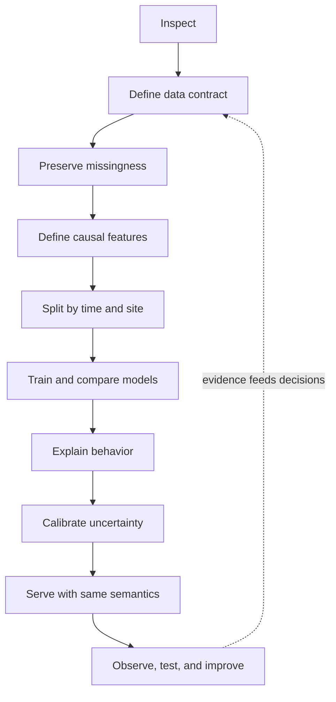

*Diagram R. The project follows a closed evidence loop: observations change design decisions, and tests preserve those decisions as executable contracts.*

The headline result is XGBoost at 1.056 kWh test MAE and 0.951 R² on the main chronological protocol. The deeper result is the surrounding evidence: recent-history features dominate, Transformer generalization is stronger for unseen sites, missing lags create a measurable night-time failure mode, and conformal intervals can explicitly price that risk.

That is the standard a forecasting platform should aim for. Not merely a number that looks good in a report, but a chain of decisions and measurements that explains why the number can be trusted, when it cannot, and how the system behaves once it leaves the notebook.

---

## Publication Asset Map

The following repository assets are used in this article and can be uploaded to Medium as accompanying images:

### Website captures

- `docs/superpowers/plans/shots/dashboard-new-cards.png` — Dashboard overview.
- `docs/superpowers/plans/shots/comparison-allruns-crosssite.png` — model comparison and cross-site analysis.
- `docs/superpowers/plans/shots/comparison-explorer.png` — prediction-versus-actual explorer.
- `docs/superpowers/plans/shots/quality-gap-timeline.png` — data quality timeline.
- `docs/superpowers/plans/shots/train-verify.png` — dataset verification.
- `docs/superpowers/plans/shots/train-running.png` — active training job.
- `docs/superpowers/plans/shots/train-results.png` — completed training results.

### EDA charts

- `artifacts/eda/01_power_distribution.png`
- `artifacts/eda/02_daily_profiles_campus.png`
- `artifacts/eda/03_monthly_energy_timeseries.png`
- `artifacts/eda/04_seasonality.png`
- `artifacts/eda/05_site_comparison.png`
- `artifacts/eda/06_weather_correlation.png`
- `artifacts/eda/07_missing_by_site.png`
- `artifacts/eda/08_missingness_heatmap.png`
- `artifacts/eda/09_timeseries_largest_site.png`

### Explainability charts

- `artifacts/shap/shap_summary_bar.png`
- `artifacts/shap/shap_beeswarm.png`
- `artifacts/shap/shap_dependence_1_power_lag_1.png`
- `artifacts/shap/shap_dependence_2_power_rolling_mean_3600s.png`
- `artifacts/shap/shap_dependence_3_power_rolling_min_3600s.png`
- `artifacts/shap/shap_waterfall_clear_noon_peak.png`
- `artifacts/shap/shap_waterfall_morning_ramp.png`
- `artifacts/shap/shap_waterfall_overcast_afternoon.png`
- `artifacts/shap/shap_waterfall_night_zero.png`

### Primary evidence files

- `RESULTS.md` — measured outcomes and run provenance.
- `DECISIONS.md` — architecture and data decisions.
- `TASKS.md` — implementation status.
- `artifacts/eda/eda_summary.md` — exploratory findings.
- `artifacts/evaluation/evaluation_report.md` — model comparison.
- `artifacts/cross_site/cross_site_report.md` — unseen-site evaluation.
- `artifacts/uncertainty/conformal_report.md` — interval calibration and coverage.

When publishing on Medium, export the selected images from the repository, upload them to Medium, and replace the local Markdown image paths with Medium-hosted image URLs. Keep the captions because they explain what each visual demonstrates and preserve the measured context behind the image.
